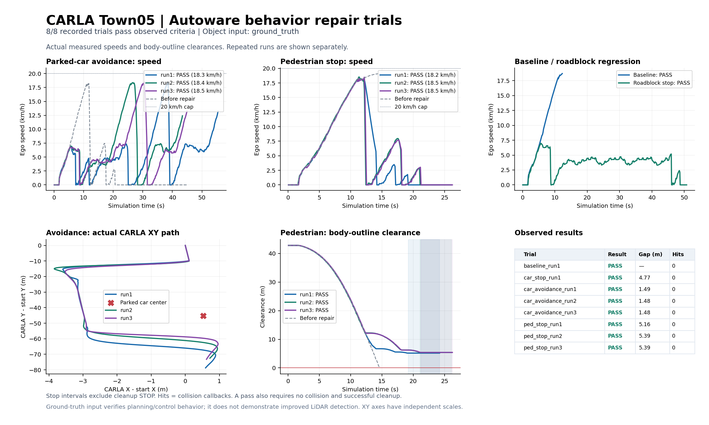

# CARLA–Autoware 행동 수정 및 실제 주행 검증 — 2026-09-22

최종 고정 이미지·지도에서 **8개 AUTO 주행 시험이 모두 통과**했다. 정차 차량 우회 3/3회, 보행자 진입 정지 3/3회이며, 기본 주행과 전방 차량 정지 회귀 시험도 각각 1회 통과했다. 시험 중 충돌 기록은 0건이다. 객체 입력은 **CARLA ground_truth**다. 센서 인식 성능 개선을 검증한 결과가 아니다.

**남은 품질 문제:** 회피와 보행자 접근 과정에서 일시 정지·재출발이 관측됐다. 요구된 충돌 없는 통과·최종 정지 유지 기준은 충족했지만, 매끄러운 단일 회피·제동을 완성했다고 볼 수 없다. 제동 명령보다 실제 감속이 크게 나타난 구간의 원인 분리와 brake map/차량 동역학 보정이 추가로 필요하다.

## 실제 원인과 수정

### 정차 차량 회피

기존 시험은 `INSUFFICIENT_DRIVABLE_SPACE(WAIT AND SEE)`로 멈췄다. CARLA road38의 -3/-2 차로 경계는 차선 변경을 허용하는 점선인데, Lanelet2 공통 경계에는 형식과 변경 허용 태그가 없었다. 실제 Autoware RouteHandler에서 기존 변경 가능 이웃은 자기 차로 `[18052]`뿐이었다.

원본 OpenDRIVE와 현재 사용 중인 지도를 대조해, 동일 방향 인접 차로이며 native laneSection 전체가 `broken + laneChange=both`인 경계 77개에만 태그를 추가했다. 노드·형상·ID·규제·속도·사용자 경계 태그를 보존했다. 혼합 표시·교차로·불명확한 구간은 변경하지 않았다. 시험 차로의 이웃은 `[18658,18355,18052]`, 좌측 연결 18355, 복귀 연결 18052로 바뀌었고, 추가한 양방향 연결 **154/154개**가 실제 RouteHandler에서 확인됐다.

최종 주행에서는 CAR 객체 입력, `avoidance_by_lane_change` 계획 요인, RTC 상태와 실제 횡방향 이동·장애물 통과·이후 주행을 함께 기록했다. 차체가 옆 차로로 이동해 장애물을 지난 결과로 판정했다.

### 보행자 입력과 정지

기존 센서 시험에서는 LiDAR 점은 있었지만 CenterPoint·추적·예측 80개 메시지가 모두 객체 0개였다. 별도 clustering 출력은 기존 추적 입력으로 연결되지 않았다. 희박한 점군은 확인했지만 모델 내부 검출 실패의 단일 원인까지 확정하지 않았다. VTD 원본은 시뮬레이터 객체를 직접 전달하고 점군을 합성했으므로 입력 경로 자체가 달랐다.

별도 `ground_truth` 모드를 추가했다. CARLA의 현재 차량·보행자 상태를 150m 범위에서 ROS TrackedObjects로 전달하고 기존 map_based_prediction과 Autoware 계획·제어를 사용한다. 좌표 반사, 3D 박스 중심·회전, 객체 기준 속도와 각속도 단위, 분류, 세션/actor 기반 UUID, 시각, 제거된 객체 처리를 맞췄다. 기존 20Hz bridge tick을 사용하며 추가 ticker는 없다. 모드별 추적 토픽 발행자는 정확히 하나다.

초기 GT 주행에서는 보행자를 검출했지만 회피 대상으로 처리해 사람 옆으로 지나갔다. 충돌은 없었으나 요청한 정지에는 실패했다. CARLA 전용 설정에서 `avoidance.target_filtering.target_type.pedestrian=false`로 바꾸고, 보행자 safety check와 차량 회피는 유지했다. 이 설정을 초기화 때 읽는 차선 변경 모듈까지 반영하도록 이미지 재빌드 후 재시작했다. 최종 3회는 run_out·road_user_stop·obstacle_stop의 계획 정지와 실제 제동으로 이어졌다.

### AEB 조사 범위

과거 실행은 AEB 점군 입력만 활성화되어 있었고, 희박한 보행자 점군은 최소 10점 군집 조건을 충족하기 어려웠다. 별도로 설치 바이너리에서도 MPC 경로 생성 시 비어 있는 vector의 `back()` 접근 오류를 확인하고 수정했다. 동일 회귀 시험은 수정 전 12/14, 수정 후 **14/14 통과**다. GT 모드에서만 AEB 예측 객체 입력을 추가 활성화하고 LiDAR 입력은 유지했다.

다만 과거 충돌 순간의 AEB 내부 기록이 없어, 이 두 조건 중 어느 것이 직접 원인이었는지 단정할 수 없다. 최종 시험의 AEB 관측과 계획 정지는 [AEB 분석](validation/carla-behavior-repair-20260922/final/aeb-analysis.json), 상세 원인 제한은 [AEB 진단 보고서](carla-aeb-diagnosis-20260922.md)에 분리했다. **계획으로 미리 정지한 시험을 AEB 긴급 개입 성공으로 계산하지 않았다.**

기본 주행을 제외한 7개 최종 시험에서 수집한 AEB 진단 800개는 모두 `No Collision`이었고 ERROR 및 `decision=brake`는 0건이었다. 보행자 3회의 관측 예측 객체는 각각 240/240, 259/259, 261/261개 메시지에서 존재했다. 정지 성공은 계획·제어 경로의 성공으로 판단한다.

## 고정 환경과 적용 확인

- 작업 폴더: `/home/a/carla_pp`; VTD 참고 원본: `/home/a/Downloads/selfcar_2026_`.
- 작업 시작 Git HEAD: `cb2aa2c6883d08227b70e796370a9bbc16124447`. 기존 수정·이전 검증 기록을 보존했다.
- 이전 실행 이미지: `sha256:1d44cf81b364baca1f1db296a8735135a81a2a696f798483f3ddb907bfd45caf`.
- 최종 이미지: `selfcar-2026-carla:behavior-repair-20260922` 및 동일 이미지의 `selfcar-2026-carla:local`.
- 최종 이미지 ID: `sha256:8bb3d0e11efdab30363636d1bddbeeae8334bb86f3699b18ef2deaf125bf5f1a`.
- 맵: CARLA 0.9.16 `Town05_Opt`, Autoware `/home/a/autoware_data/maps/Town05/lanelet2_map.osm`.
- 이전 지도 SHA256: `413bf0a9e9c08357d284364d8a70d9a1e94fed64c1a8b8854df65b2a214468a8`.
- 최종 지도 SHA256: `44628aefb80c91e64d8d65c318f257b96182e8365406483f7747a343ea8b1ef8`.
- 원본 XODR SHA256: `7edc53b0be840e177598da7a4ed9571146d7b2595ce280d154c90f92e8a48851`.
- 지도 이전 번들 백업: `/home/a/autoware_data/maps/Town05/backups/carla-map-20260922T091558Z-4ae46812`.
- 센서 모드 실행 확인 19/19, GT 모드 실행 확인 21/21 통과. 초기화 완료 전에 수행한 검사 실패도 보존했다.
- 최종 이미지 bridge 시험 20개, 지도 보존/허용 조건 시험 7개, native lane 조회 회귀 시험 8개, 설치 AEB 라이브러리 시험 14개 통과.

## 실제 AUTO 주행 결과

기존 실패와 같은 Town05 동쪽 road38/lane -3 구간에서 시작했다. CARLA 시작 위치는 약 `(210.341,74.101)`, 전방 약 45m에 장애물을 배치했다. 보행자는 오른쪽 약 2.75m에서 대기하다 에고가 약 25m 이내로 접근하면 1.8m/s로 진입하고 차로를 막았다. NPC는 시험 중 분리했다. 임시 속도 상한은 20km/h이며 아래 수치는 **실제 측정 속도**다.

| 시험 | 실제 최고 속도 km/h | 최소 차체 간격 m | 실제 동작 | 충돌 | 판정 |
|---|---:|---:|---|---:|---|
| 기본 주행 1 | 18.69 | — | 30.49m 주행 | 0 | PASS |
| 전방 3개 차로 정차 차량 1 | 6.99 | 4.769 | 2.00초 정지 | 0 | PASS |
| 정차 차량 1대 우회 1 | 18.33 | 1.485 | 통과 후 3.05초 계속 주행 | 0 | PASS |
| 정차 차량 1대 우회 2 | 18.38 | 1.483 | 통과 후 3.00초 계속 주행 | 0 | PASS |
| 정차 차량 1대 우회 3 | 18.46 | 1.484 | 통과 후 3.05초 계속 주행 | 0 | PASS |
| 보행자 진입 정지 1 | 18.23 | 5.161 | 5.00초 정지 | 0 | PASS |
| 보행자 진입 정지 2 | 18.54 | 5.392 | 5.00초 정지 | 0 | PASS |
| 보행자 진입 정지 3 | 18.49 | 5.394 | 5.00초 정지 | 0 | PASS |

간격은 CARLA 실제 bounding box의 수평 차체 외곽 간 최단거리다. 정지는 속도 0.15m/s 미만, 보행자가 실제 차로를 막는 동안 연속 5초 이상으로 검증했다. 회피는 장애물보다 12m 이상 전진하고 2m/s 초과 주행을 3초 이어가야 통과한다. STOP 정리 단계는 판정 시간에서 제외했다.

우회 1/2/3회차의 장애물 중심을 지나기 전 실제 최고 접근 속도는 각각 17.15/18.38/17.28km/h다. 표의 전체 주행 최고 속도와 구분한다. 보행자 시험의 최고 속도는 모두 보행자에 접근하는 구간에서 측정됐다.

전방 차량 정지 회귀 시험은 변경 가능한 3개 차로에 차량을 놓아 우회가 불가능한 조건이다. GT가 전방 차량을 일찍 인지해 약 7km/h 이하로 서행했다. 따라서 이 결과를 20km/h 접근 정지 시험으로 해석하면 안 된다. 의미 있는 움직임 기준은 이 정지 시험에서 1m/s이며 실제 이동 거리·간격·정지 유지도 함께 확인했다. 차로가 모두 막혔는데 중간에 다른 차로를 선택하는 동작은 남아 있다.

| 정지 시험 | 주행 시작 후 첫 제동 s | 보행자 진입 트리거 후 s | 제동 시작 실제 속도 km/h | 제동 시작 간격 m |
|---|---:|---:|---:|---:|
| 전방 3개 차로 정차 차량 1 | 8.60 | — | 6.00 | 30.886 |
| 보행자 진입 정지 1 | 12.25 | 1.95 | 17.86 | 12.582 |
| 보행자 진입 정지 2 | 12.20 | 1.90 | 16.39 | 12.757 |
| 보행자 진입 정지 3 | 12.30 | 1.95 | 15.75 | 12.591 |

첫 제동은 주행 속도 0.5m/s 초과에서 실제 CARLA brake가 0.01을 처음 초과한 샘플이다. CARLA 프레임 시간으로 계산했고, ROS 객체 시각과 혼용하지 않았다. 주행 샘플에 Autoware 제어 명령과 CARLA 실제 응답을 함께 보존했다.

| 정지 시험 | 정지 유지 종료 위치 CARLA (x,y) m | 최종 차체 간격 m | 시작점 대비 전진 m |
|---|---|---:|---:|
| 전방 3개 차로 정차 차량 1 | (210.386, 38.324) | 4.770 | 35.777 |
| 보행자 진입 정지 1 | (210.778, 36.479) | 5.162 | 37.622 |
| 보행자 진입 정지 2 | (210.775, 36.710) | 5.393 | 37.392 |
| 보행자 진입 정지 3 | (210.775, 36.713) | 5.396 | 37.389 |



## 실패·시험 도구 보정 기록

실패를 최종 성공으로 덮어쓰지 않았다. 초기 GT 이미지의 보행자 우회 실패, 저속 차량 정지를 기존 2m/s 움직임 기준 때문에 timeout으로 처리한 시험, 시작 단계 오류를 `attempts/`에 보존했다. 최종 이미지의 첫 suite는 회피 2회차에서 native 차로 조회가 None을 반환해 중단됐다.

오프라인 원본 OpenDRIVE 검사 결과 해당 좌표는 내부 공통 경계 부근의 실제 주행 차로 안이었다. 시험 도구는 직접 native 조회가 실패한 경우에만, 같은 방향·도로·구간의 붙어 있는 두 차로를 각각 검사하도록 수정했다. 각 차로 자체 폭 안에 있어야 하며 도로 폭을 확장하지 않는다. 외부 도로·반대 방향·단절·교차로를 무조건 허용하지 않는 회귀 시험도 통과했다. 이전 결과는 `attempts/final-suite-attempt1/`에 남기고, 수정된 도구로 위 8개 시험을 전부 새로 실행했다. [기하 증명](validation/carla-behavior-repair-20260922/final/query-seam-proof.json)을 참고한다.

시험 도구가 에고의 직접 브레이크·강제 조향·CARLA autopilot으로 성공을 만들지 않았다. AUTO 중 에고는 Autoware가 제어했다. 위치 초기화는 STOP 상태에서만 수행했다. 보행자/NPC 제어와 에고 제어는 구분했다.

## 종료 상태와 남은 범위

시험용 객체·경로·속도 제한을 정리하고 에고를 원래 위치 부근의 **STOP**으로 복원했다. 원래 배경 차량 18대의 종류·속성·위치를 기준으로 새 actor를 생성하고 Traffic Manager 주행을 복원했다. 최종 차량 수는 19대(에고 포함), 보행자 0명이다. 새로운 actor ID를 사용하며 시험 동안의 원래 차량 이동 궤적을 되감은 것은 아니다. [복원 기록](validation/carla-behavior-repair-20260922/scene_restore.json)을 보존했다.

남은 범위는 다음과 같다.

- LiDAR/CenterPoint 보행자 검출 누락은 해결됐다고 주장하지 않는다. 센서 모드에서는 동일 행동 성공을 재검증하지 않았다.
- GT는 150m 내 현재 객체 상태를 사용하며 가림·탐지 실패를 재현하지 않는다. 미래 시나리오 정보는 전달하지 않는다.
- 세 번 반복한 특정 도로·속도·진입 조건의 결과다. 더 늦고 빠른 돌발 진입, 고속 주행, 악천후, 혼잡한 배경 교통, 모든 신호등·횡단보도 상황의 성공을 보장하지 않는다.
- AEB 강제 긴급 개입과 최소 충돌 회피 한계는 별도 시험이 필요하다. 이번 보행자 성공은 계획 정지다.
- 회피·보행자 접근 중 일시 정지와 재출발이 있다. 회피 1회차의 한 구간에서는 실제 속도가 약 5.09m/s에서 0.001m/s까지 0.65초에 감소했지만 제어 가속도는 약 -0.73~-1.08m/s², 실제 brake는 약 0.17~0.257이었다. 명령은 최신이었고 AUTO가 유지됐으며 AEB 개입·충돌이 없었다. 제동 매핑/차량 동역학 불일치의 근거이지만 단일 원인을 확정하지 않았다. [제동 응답 기록](validation/carla-behavior-repair-20260922/final/braking-response-analysis.json)을 참고한다.
- 혼합 차선 표시 등 보수적으로 남긴 지도 구간은 추가 변환과 검증이 필요하다.

## 변경 파일과 재실행

- 객체 입력: [ground_truth_objects.py](../carla_overlay/src/autoware_carla_interface/src/autoware_carla_interface/modules/ground_truth_objects.py), [carla_ros.py](../carla_overlay/src/autoware_carla_interface/src/autoware_carla_interface/carla_ros.py), 패키지/`config/carla/launch` launch 파일.
- 적용·실행: [installer](../docker/files/install_carla_runtime.py), [Dockerfile](../docker/carla/Dockerfile), [compose](../docker/carla/compose.yaml), [launcher](../scripts/carla/carla_autoware).
- 지도: [변환 도구](../tools/map/repair_town05_lane_changes.py), [지도 준비](../scripts/carla/prepare_town05_map), [지도 상세](carla-town05-lane-changes.md), 실제 RouteHandler 검사와 지도 시험.
- 계획/AEB: [보행자 회피 정책](../config/carla/planning/scenario_planning/lane_driving/behavior_planning/behavior_path_planner/autoware_behavior_path_static_obstacle_avoidance_module/static_obstacle_avoidance.param.yaml), [GT AEB 설정](../config/carla/control/autonomous_emergency_braking/ground_truth.param.yaml), [AEB overlay](../carla_overlay/src/autoware_autonomous_emergency_braking).
- 검증: [주행 도구](../tools/carla_closed_loop_validation.py), [시험 객체](../tools/carla_validation_actors.py), [native 차로 판정](../tools/carla_native_lane_check.py), [실행 검사](../tools/carla_behavior_runtime_check.py), [AEB 관측기](../tools/carla_aeb_observer.py), 분석/그래프와 회귀 시험 파일.
- 원시 기록·버전·해시: [evidence 폴더](validation/carla-behavior-repair-20260922/), [환경](validation/carla-behavior-repair-20260922/final/environment.json), [실측 분석](validation/carla-behavior-repair-20260922/final/analysis.json), [SHA256 목록](validation/carla-behavior-repair-20260922/SHA256SUMS.json). 큰 AEB 기록과 이전 시도는 내용 손실 없이 gzip 압축했다. 기존 실패 보고서와 원시 기록은 수정하지 않았다.

현재는 GT 모드로 실행 중이며 STOP 상태다. 나중에 재시작할 때는 다음을 사용한다. `stop`은 현재 동적 객체를 정리하므로 진행 중인 시나리오를 종료한 뒤 실행한다.

```bash
cd /home/a/carla_pp
./scripts/carla/carla_autoware stop
CARLA_PERCEPTION_MODE=ground_truth ./scripts/carla/carla_autoware start-town05
```

일반 시작의 기본값은 `sensor`다. 두 모드의 동작과 읽기 전용 확인 명령은 [객체 입력 모드 문서](carla-ground-truth.md)를 따른다.
