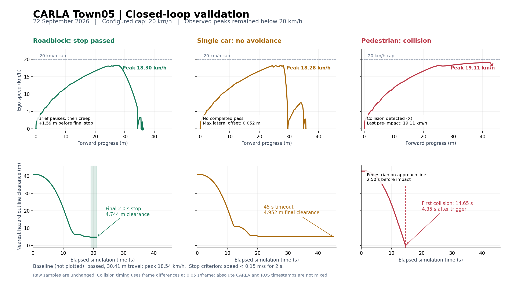

# CARLA 실제 주행 검증 — 2026-09-22

**차량 앞 정지는 통과했고, 정차 차량 우회와 보행자 진입 정지는 실패했다.** 모듈 실행·토픽 연결 확인에서 더 나아가, 현재 실행 이미지로 Autoware AUTO 주행을 수행하고 CARLA 실제 속도·제동·차체 간격·충돌 센서와 ROS 객체·계획 결과를 함께 기록했다.

| 시험 | 결과 | 실제 관측 |
|---|---|---|
| 장애물 없는 기본 주행 | 통과 | 30.41m 진행, 최고 18.54km/h, 충돌 없음 |
| 정차 차량으로 세 차로를 막은 경우 | 정지 통과 | 최고 18.30km/h, 최종 차체 간격 4.744m에서 2초 이상 정지, 충돌 없음 |
| 같은 차로의 정차 차량 한 대, 옆 차로 비어 있음 | 회피 실패 | 45초 동안 우회하지 않고 4.952m 앞에 정지. 재시험 35초에서도 같은 실패 |
| 에고 접근 시 보행자가 차로로 진입 | 정지 실패·충돌 | 충돌 직전 19.11km/h, brake=0. 보행자가 예측 객체로 전달되지 않음 |

## 시험 조건과 판정 범위

- CARLA 0.9.16, `Town05_Opt`, Prius ego actor 173. 기존 브리지가 유일한 world ticker이며 시험 도구는 `world.tick()`을 호출하지 않았다.
- Town05 동쪽 3차로 직선 구간: CARLA 시작점 `(210.341, 74.101)`, road 38 / lane -3, 약 140m 전방에 Goal. Autoware 경로 lanelet은 `18052 → 2900 → 8924`였다.
- 배경 차량 19대를 잠시 분리하고 시험 대상만 생성했다. 모든 시험에 **20km/h 임시 상한**을 적용했다. 이는 출발부터 실제 속도 20km/h를 유지했다는 뜻이 아니다. 표의 속도는 CARLA에서 측정한 최고 속도다.
- 정차 차량은 약 45m 전방에 배치했다. 보행자는 같은 전방 위치의 차로 중심에서 옆으로 2.75m 떨어진 곳에서 대기하다 에고가 25m 이내에 오면 1.8m/s로 진입하여 차로 중심에 멈췄다.
- 정지 통과 조건은 주행 후 장애물과 접촉하지 않고 속도 0.15m/s 미만을 2초 유지하는 것이다. 간격은 차량·보행자 bounding box의 수평면 외곽 간 최단 거리다. 회피는 장애물을 지나고 실제 횡방향 이동이 있어야 통과한다.
- 기본 주행·도로 차단 정지·보행자 진입은 각각 1회, 단일 차량 회피는 2회 수행했다. 신호등 정지/출발, 지도 횡단보도 규칙, 주행 차량 급끼어들기, 다양한 속도·날씨는 이번 검증에 포함되지 않았다.

## 확인된 동작과 실패 원인

**차량 정지:** 전방 차량과 일치하는 예측 객체가 들어왔고 `obstacle_stop` 계획 요인이 107회 관측됐다. 정지 원인 좌표도 실제 전방 Prius와 약 0.27m 이내였다. 움직이는 동안 처음 brake가 들어온 시점은 약 17.85km/h, 차체 간격 12.14m였다. 처음 약 6.35m 앞에서 잠시 멈춘 뒤 총 약 1.59m를 저속으로 더 전진했으므로, 매끄러운 단일 제동으로 정지한 것은 아니다. 최종 4.744m 간격에서 2초 동안 유지한 정지는 확인됐다.

**차량 회피:** 첫 시험 최대 횡방향 이동은 약 0.052m에 불과했고, 장애물을 통과하지 못했다. 재시험에서도 정지했으며 실제 정적 회피 디버그 메시지 226개 모두 `INSUFFICIENT_DRIVABLE_SPACE(WAIT AND SEE)`였다. 회피 후보 경로·비어 있지 않은 RTC 요청은 생성되지 않았다. 실제 RTC 자동 모드도 켜져 있어 사용자 승인 대기 때문에 멈춘 상황은 아니었다.

지도에도 관련 제약이 있다. CARLA 원본은 좌측 점선과 차로 변경을 허용하지만, 해당 Lanelet2 공통 경계 way `18050`에는 차선 형식 태그가 없다. 현재 이미지의 경로 처리기가 반환한 변경 가능 이웃은 자기 lanelet `18052`뿐이며, 실제 옆 차로 `18355`를 포함하지 않는다. **주행 가능 공간 부족이라는 실행 중 판단과 지도 연결 제약을 각각 확인했다.** 지도 수정 후 재시험은 하지 않았으므로 이것만 고치면 회피가 반드시 성공한다고 단정하지 않는다.

**보행자 정지:** 보행자는 실제로 차로에 들어왔다. 진입 시작 4.35초 뒤 충돌했고, 충돌 2.50초 전부터 차로 중심에서 약 0.047m 떨어진 곳에 정지해 있었다. 첫 충돌 frame은 `218406`; 바로 전 frame `218405`에서 에고 속도 19.11km/h, brake=0이었다. 시험 중 136개 샘플 모두 예측 객체가 비어 있었고 정지 계획 요인도 관측되지 않았다. 충돌 기록 43개는 제동 정리 중 이어진 접촉 콜백을 포함하며, 43회 독립 시험을 의미하지 않는다.

충돌 후 에고를 STOP으로 두고 같은 보행자 모델을 약 10m 앞에 배치해 별도 8초 진단을 수행했다.

| 단계 | 정지 진단 결과 |
|---|---|
| 원본 LiDAR | 조사한 점군 40개 모두 보행자 ROI 존재. 박스 내부 6~13점, 중앙값 8점 |
| self/mirror/range crop | 해당 점들을 유지 |
| 지면 제거 이후 | 5~11점, 중앙값 6점. 이후 occupancy/map 필터에도 점이 남음 |
| CenterPoint | 출력 메시지 80개 모두 검출 객체 0개 |
| Clustering | 80개 중 5개 메시지에서 보행자 근처 UNKNOWN 객체 검출 |
| 추적 → 예측 | 각각 80개 메시지 모두 객체 0개 |

CenterPoint에는 PEDESTRIAN 클래스가 활성화되어 있고 입력 점군도 연결돼 있었다. 그러나 실제 검출은 실패했다. Clustering 객체 토픽은 현재 추적기에 연결되지 않았으며 진단 노드만 구독하고 있었다. 따라서 간헐적 군집 결과도 계획까지 전달되지 않는다.

희박한 점군은 유력한 원인 후보다. 후처리 ROI 40개 중 38개가 10점 미만이었고 clustering/AEB에는 최소 10점 조건이 있다. 다만 모델의 threshold 이전 출력이나 충돌 당시 AEB 내부 판정을 수집하지 않았으므로 **검출 실패의 세부 원인과 AEB 미제동 원인까지 확정한 것은 아니다.** 정지 진단 중 AEB는 원래 주행 조건을 만족하지 않아 그 상태의 미개입을 오류로 판정하지 않았다.

## 실행 버전과 정리 상태

- 코드 HEAD: `cb2aa2c6883d08227b70e796370a9bbc16124447`
- 실행 이미지: `sha256:1d44cf81b364baca1f1db296a8735135a81a2a696f798483f3ddb907bfd45caf`
- Town05 Lanelet2 SHA256: `413bf0a9e9c08357d284364d8a70d9a1e94fed64c1a8b8854df65b2a214468a8`
- 이번 검증에서 운영 소스·지도·검출/계획 파라미터를 변경하지 않았다. 추가 파일은 시험·진단 도구와 기록이다.
- 시험 및 진단 객체를 모두 제거했다. 에고를 시험 전 위치 `(-46.73565, 48.37295)`로 복원하고, 기존 배경 차량 19대를 저장한 차종·속성·위치로 재생성하여 autopilot을 재개했다. NPC actor ID와 시간에 따른 교통 상태는 새로 시작한다.
- 최종 확인: 차량 총 20대, 보행자 0명, 임시 객체 0개, ego STOP·실측 속도 약 0m/s, 시험 경로 UNSET. 시험 속도 제한 sender도 제거됐다. CARLA와 Autoware는 종료하지 않았다.

## 증거 및 재현 도구

원시 기록은 [validation 폴더](validation/carla-closed-loop-20260922)에 저장했다. `baseline.json`, `vehicle_stop.json`, `vehicle_avoidance.json`, `vehicle_avoidance_repeat.json`, `pedestrian_stop.json`이 실제 주행 결과다. 별도 분석은 `analysis.json`, 회피 이유는 `avoidance_diagnosis.json`, 보행자 입력 진단은 `pedestrian_perception.json`과 `pedestrian_perception_summary.json`, 정리 결과는 `scene_restore.json`에 있다. `manifest.json`에 기록 파일과 도구의 SHA256을 보존했다.

시간 계산 시 `samples[].sim_s`는 시험 시작부터의 CARLA 상대 시간, ROS stamp/event는 ROS 시계, 충돌 센서 timestamp는 CARLA 절대 시간이다. 서로 다른 절대 시계를 빼지 않았다. 보행자 진입~충돌 시간은 CARLA frame 차이 × 0.05초로 계산했다. 초기 두 시험의 `max_lateral_m`은 waypoint 거리 기반 값이므로 정밀 횡이동 평가에 사용하지 않았다. 회피·보행자 시험은 횡방향 투영값을 사용했다.

주행 시험 도구는 [carla_closed_loop_validation.py](../tools/carla_closed_loop_validation.py), 배우 생성 도구는 [carla_validation_actors.py](../tools/carla_validation_actors.py)다. 이 도구는 시뮬레이터의 에고를 재배치하고 AUTO에 진입하므로 진행 중인 시나리오와 함께 실행하면 안 된다. `--isolate-traffic`은 기존 NPC를 제거하고 원래 장면을 JSON에 저장하지만 자동으로 복원하지 않는다. 이번 시험의 장면 복원은 별도로 완료했다.

읽기 전용 진단 도구는 [carla_avoidance_observer.py](../tools/carla_avoidance_observer.py)와 [carla_pedestrian_perception_probe.py](../tools/carla_pedestrian_perception_probe.py)다. 그래프는 [plot_carla_closed_loop_validation.py](../tools/plot_carla_closed_loop_validation.py)로 원시 기록에서 다시 만들 수 있다.

다음 수정 우선순위는 보행자 검출·추적 입력 및 AEB 누락 분석, 그다음 Town05 차선 변경 연결/주행 공간 수정이다. 수정 후 동일 조건을 다시 통과하는지 확인해야 하며, 현재 결과로 차량 회피나 보행자 정지가 정상 동작한다고 보고할 수 없다.
